<div align="center">


# wedding-rsvp-site-simitka

### Никита ♥ Ульяна · 11 сентября 2026 · Chubini Wine Cellar, Кахетия

*Сайт-приглашение на одну свадьбу. Один файл, ноль фреймворков, много скотча.* ✂️

<sub>vanilla HTML/CSS/JS · zero build · nginx + Docker · Node без зависимостей · Google Sheets</sub>

</div>

---

## ✂️ Что это

Одностраничное приглашение на свадьбу Никиты и Ульяны. **11 сентября 2026, сбор в 16:00 по Грузии** – на маленькой семейной винодельне Chubini Wine Cellar, посреди виноградников Кахетии.

Сайт не просто зовёт в гости – он ещё и спрашивает, кто доедет: рядом с приглашением живёт RSVP-анкета. Гость вводит своё секретное слово, отвечает на пару вопросов (приедешь ли, нужен ли трансфер, останешься ли на ночёвку), а ответы тихо уезжают в Google-таблицу, по которой мы считаем гостей, машины и спальные места.

## 🎨 Стиль

Это нарочитый скрапбук в эстетике 90-х – будто приглашение собрали ножницами и клеем за кухонным столом. Заголовки в духе ransom-note (буквы, вырезанные из разных журналов), блоки повёрнуты под небрежным углом (`rotate`), тени жёсткие и без размытия (`box-shadow` без блюра), края рваные (`clip-path: polygon(...)`). Повсюду «скотч», стикеры и детские фото жениха и невесты с честными подписями «это жених» / «это невеста».

Шрифты – рукописные и плакатные (Caveat, Amatic SC, Neucha), палитра яркая: акцент-малина `#A31D4E` плюс небо, манго, олива и виноград. Тексты – живые и с усмешкой: «женятся!!! (да, правда)», «банда уже на месте!», а грузится всё это под вывеской старой ОС – **LOVE.EXE**.

## 📱 Мобильная версия

Дизайн mobile-first – именно с телефона его чаще всего и откроют.

<table>
<tr>
<td align="center">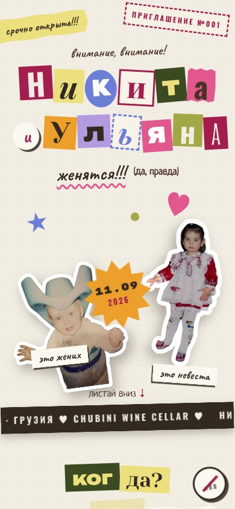</td>
<td align="center">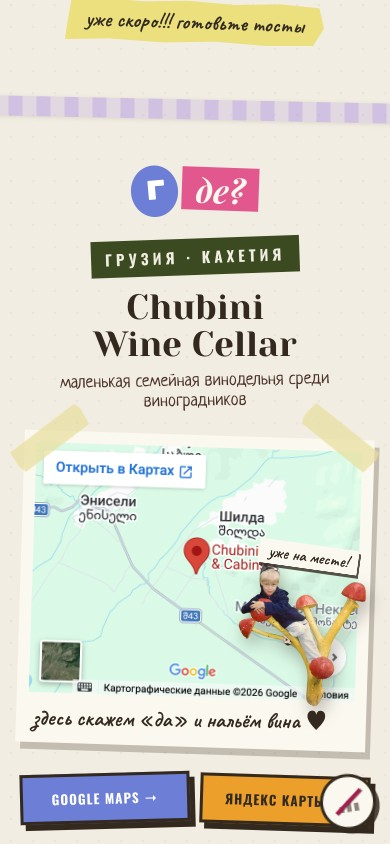</td>
<td align="center">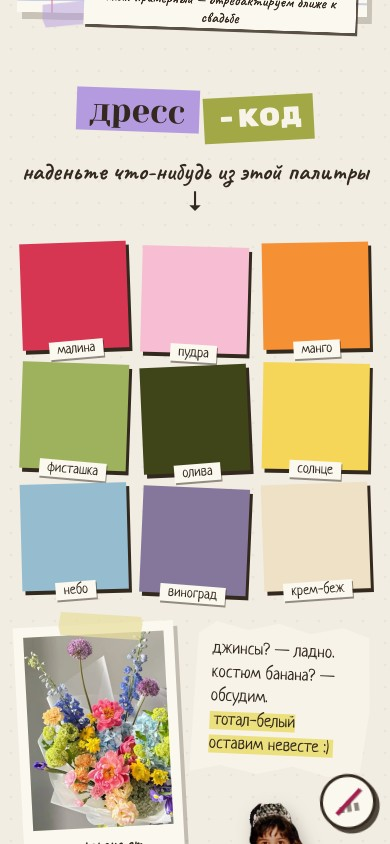</td>
<td align="center">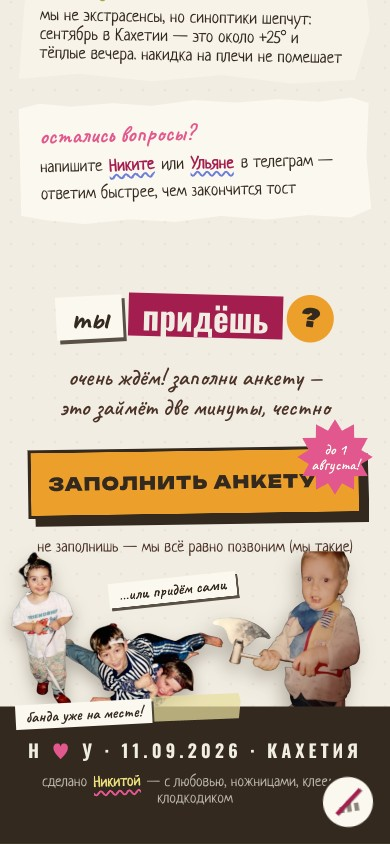</td>
</tr>
<tr>
<td align="center"><sub><b>Шапка</b><br />ransom-note и звезда даты</sub></td>
<td align="center"><sub><b>Где</b><br />винодельня и карта</sub></td>
<td align="center"><sub><b>Дресс-код</b><br />палитра стикерами от флориста</sub></td>
<td align="center"><sub><b>RSVP</b><br />«ты придёшь?»</sub></td>
</tr>
</table>

## 💾 Загрузка

Пока страница «прогревается», её держит **LOVE.EXE** – буд-лоудер в стиле старой ОС, который фоном докачивает все картинки, звуки и пасхалки. Когда полоса доходит до 100%, сайт открывается уже без единой подгрузки.

<table>
<tr>
<td align="center">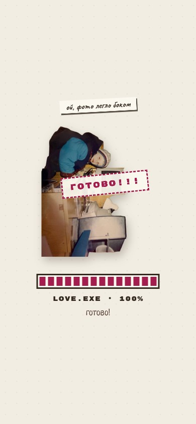</td>
<td align="center">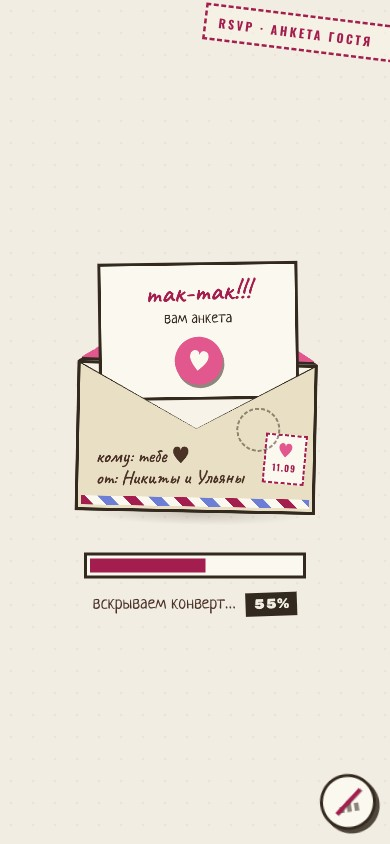</td>
</tr>
<tr>
<td align="center"><sub><b>LOVE.EXE</b> · буд-лоудер сайта</sub></td>
<td align="center"><sub><b>Конверт</b> · лоудер анкеты</sub></td>
</tr>
</table>

## ✉️ RSVP-анкета

Анкета – это не отдельная страница, а оверлей, который выезжает поверх приглашения «конвертом» и ведёт гостя по сценарию:

<div align="center">

**секрет → привет → придёшь? → дорога → ночёвка → чек → готово**

</div>

<table>
<tr>
<td align="center">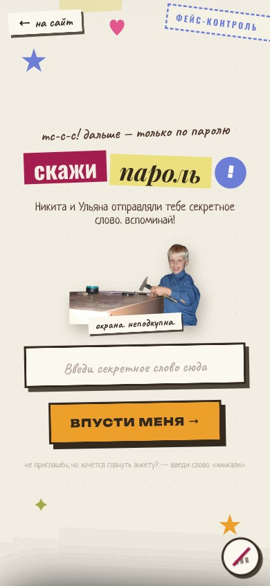</td>
<td align="center">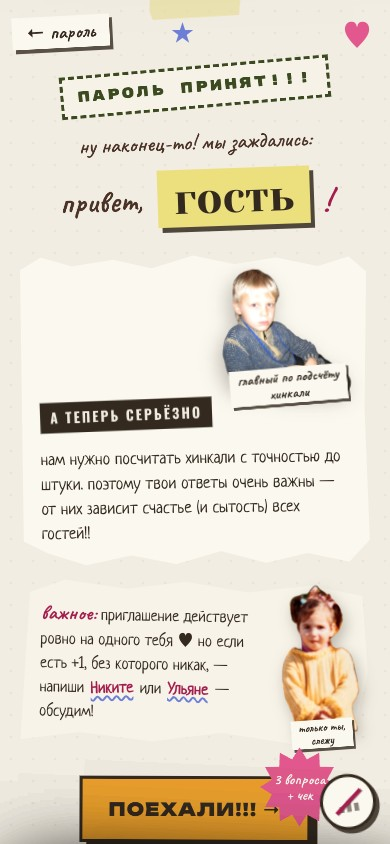</td>
<td align="center">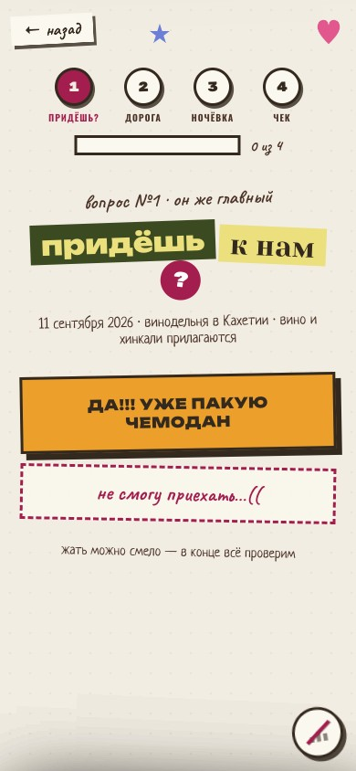</td>
<td align="center">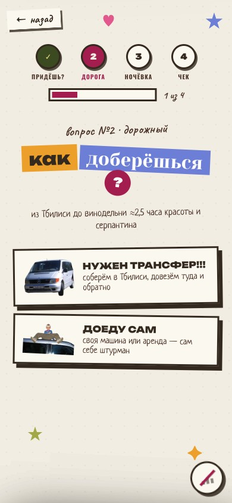</td>
</tr>
<tr>
<td align="center"><sub><b>Секретное слово</b><br />вход только для своих</sub></td>
<td align="center"><sub><b>Привет, гость</b><br />анкета узнаёт, кто пришёл</sub></td>
<td align="center"><sub><b>Придёшь?</b><br />главный вопрос</sub></td>
<td align="center"><sub><b>Дорога</b><br />трансфер из Тбилиси</sub></td>
</tr>
</table>

Гость вводит секретное слово, отвечает на несколько простых вопросов, а на финале ответы уходят в Google-таблицу – по ней удобно свести список приехавших, кому нужен трансфер и сколько мест для ночёвки готовить.

Бэкенд анкеты наружу не торчит: браузер общается только с nginx по пути `/api/`, а тот уже проксирует запросы на внутренний Node-сервис. Без ключа Google сервис поднимается в демо-режиме – ответы никуда не улетают, а для входа работают слова-примеры (`хинкали` / `сациви`).

## 🧩 Что внутри

- ⏳ **Обратный отсчёт** до даты – тикает прямо в шапке.
- 🎞️ **Появление по скроллу** – блоки въезжают слева/справа, «падают» и «шлёпаются» на страницу.
- 🖼️ **Параллакс** – фон и фотографии живут на разной глубине.
- 🌀 **Фото крутятся по клику** – потому что могут.
- 💾 **Буд-лоудер LOVE.EXE** – держит экран, пока фоном не докачаются все ассеты; страница открывается уже «прогретой».
- 🖥️ **Отдельная десктоп/лендскейп-раскладка** – крупный коллаж во весь экран вместо ужатого мобильного.
- ♿ **Честный контракт с `prefers-reduced-motion`** – кому нельзя мельтешение, у того всё замирает по-настоящему.
- 🥚 **Пасхалки** – прячутся, ищутся.
- ✉️ **RSVP-анкета оверлеем** – выезжает «конвертом», ведёт по шагам и пишет ответы в Google Sheets.

## 🖥️ Десктоп-версия

На широком экране (и на телефоне в лендскейпе) вместо ужатого мобильного макета разворачивается крупный коллаж во весь экран – со своим «звук-гейтом» на входе и двухколоночными «листами».

<table>
<tr>
<td align="center">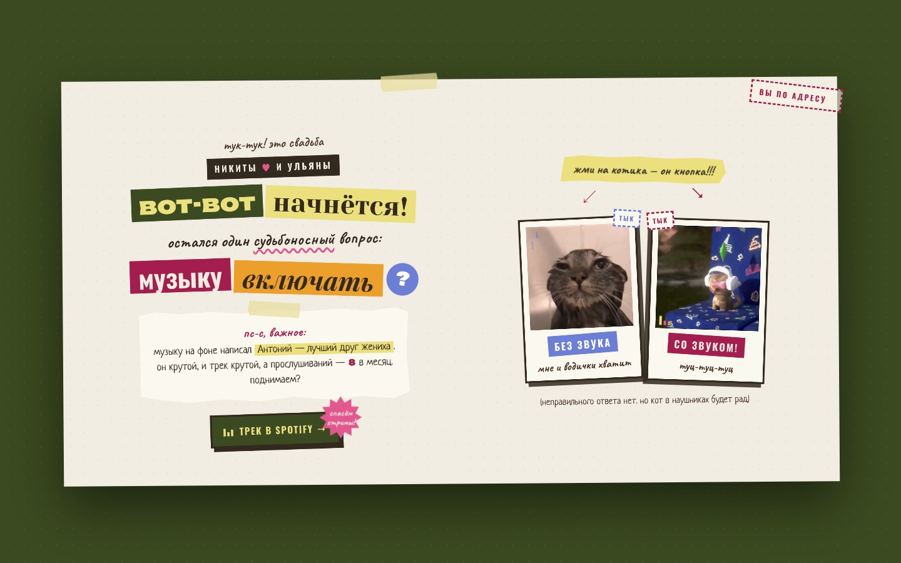</td>
<td align="center">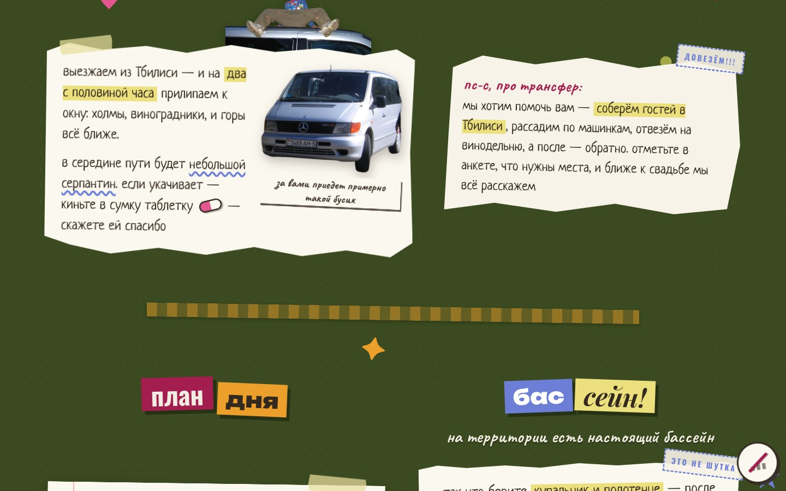</td>
</tr>
<tr>
<td align="center"><sub><b>Звук-гейт</b> · «музыку включать?»</sub></td>
<td align="center"><sub><b>Листы</b> · трансфер, план дня, бассейн</sub></td>
</tr>
</table>

## 🛠️ Технологии

- **Фронтенд без сборки** – весь UI, стили и логика в одном `index.html`: инлайновые стили + один `<script>` (IIFE). Никаких npm-зависимостей и фреймворков на клиенте.
- **Картинки, звуки и пасхалки** – в `assets/`.
- **Шрифты** – Google Fonts (Caveat, Amatic SC, Neucha и компания).
- **Бэкенд анкеты** – Node 22, ESM, **без npm-зависимостей**; пишет в Google-таблицу через Sheets REST API.
- **Раздача** – nginx в Docker; фронт и `/api/` за одним хостом.
- **Деплой** – Dokploy (self-hosted PaaS). Прод: **https://wedding.simitka.io/**

## ▶️ Как запустить

**Быстро глянуть вёрстку** (анкета в этом режиме не работает – нет бэкенда):

```bash
open index.html
```

**Локальный сервер статики** → http://localhost:8000

```bash
python3 -m http.server 8000
```

**Полный стек «как на проде»** (сайт + RSVP API за одним nginx) → http://localhost:8080

```bash
docker compose up --build
```

Бэкенд без ключа Google поднимется в демо-режиме; секретные слова-примеры для входа – `хинкали` и `сациви`.

## 🗂️ Структура репозитория

```
.
├── index.html            # весь сайт: разметка, стили, скрипт
├── assets/               # картинки, звуки, пасхалки
│   ├── egg/              #   пасхалки
│   └── rsvp/             #   картинки анкеты
├── backend/              # Node-сервис RSVP (без npm-зависимостей)
│   └── src/
│       ├── server.js     #   роуты и лимиты
│       ├── guests.js     #   список приглашённых
│       ├── rsvp.js       #   приём и запись ответов
│       └── sheets.js     #   доступ к Google Sheets
├── Dockerfile            # образ сайта (nginx)
├── nginx.conf.template   # SPA-fallback + прокси /api/
├── docker-compose.yml    # локальный стек целиком
└── docs/screenshots/     # скриншоты для этого README
```

---

<div align="center">

Сделано с ножницами, клеем и любовью. Увидимся среди виноградников 🍇

<sub><b>Никита ♥ Ульяна</b> · 11.09.2026 · Chubini Wine Cellar, Кахетия</sub>

</div>
